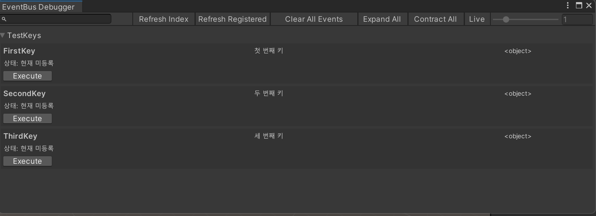
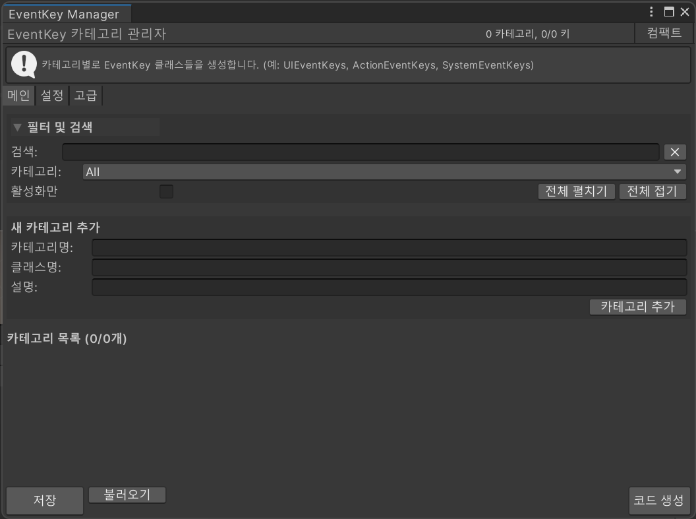

# Unity Event Bus System

Unity 프로젝트에서 **컴포넌트 간의 의존성을 줄이고, 강력한 타입 안정성을 보장하는 이벤트 버스 프레임워크**입니다.  
런타임 이벤트 관리뿐 아니라, **에디터 전용 관리 툴과 디버거**까지 함께 제공하여 개발 효율성과 디버깅 편의성을 높입니다.

---

## ✨ 주요 기능
- **타입 안정성 보장 (Generic EventKey<T>)**  
  문자열 기반 이벤트 호출 대신 제네릭 키를 사용하여 컴파일 타임에서 안전성을 확보.
- **중앙화된 EventBusSystem**  
  - 이벤트 등록(Register) / 해제(Unregister) / 실행(Execute) 지원  
  - 잘못된 타입 사용 시 경고 로그 출력  
  - 전체 이벤트 초기화 기능 제공
- **에디터 확장 기능**  
  - **EventBus Debugger**: 현재 등록된 이벤트 상태 확인, 리스너 목록 출력, 이벤트 즉시 실행 테스트  
  - **EventKey Editor**: 이벤트 키 카테고리 관리, 자동 코드 생성, JSON 내보내기/가져오기, 중복 키 검사  
  - **Type Search Popup**: 프로젝트 내 타입 검색 및 지정

---

## 📂 프로젝트 구성
| 파일 | 설명 |
|------|------|
| **EventBusSystem.cs** | 코어 이벤트 버스. 이벤트 등록/실행/해제 기능 제공 |
| **EventKey.cs** | 타입 안전성을 위한 제네릭 이벤트 키 정의 |
| **EventBusDebugger.cs** | Unity 에디터에서 이벤트 등록 상태를 시각적으로 확인하고 실행할 수 있는 디버거 |
| **EventKeyEditor.cs** | 이벤트 키 생성·관리 전용 에디터 툴, 자동 코드 생성 및 JSON 관리 |
| **TypeSearchPopup.cs** | 프로젝트 내 타입을 검색할 수 있는 유틸리티 팝업 |

---

## 🚀 사용 예시

### 1. 이벤트 키 정의
**이벤트 키는 EventKeyManager를 이용해서 등록하여야 Editor에서 관리가 가능합니다.**
```csharp
public static class UIEventKeys
{
    public static readonly EventKey<string> OnButtonClick 
        = new("UI.OnButtonClick", "버튼 클릭 시 발생");
}
```

### 2. 이벤트 등록
```csharp
void Start()
{
    EventBusSystem.Register(UIEventKeys.OnButtonClick, OnButtonClicked);
}

private void OnButtonClicked(string buttonName)
{
    Debug.Log($"버튼 클릭됨: {buttonName}");
}
```

### 3. 이벤트 실행
```csharp
// 예: 버튼 클릭 시 실행
EventBusSystem.Execute(UIEventKeys.OnButtonClick, "PlayButton");
```

### 4. 이벤트 해제
```csharp
void OnDestroy()
{
    EventBusSystem.Unregister(UIEventKeys.OnButtonClick, OnButtonClicked);
}
```
---
## Editor

### 1. EventKeyDebugger
**Tools → Event Bus → Debugger**

등록된 이벤트와 리스너 확인 /
파라미터 입력 후 실행 가능 /
전체 이벤트 초기화 버튼 제공

### 2. EventKeyManager
**Tools → Event Bus → Key Manager**

카테고리별 이벤트 키 관리 / 자동 코드 생성 (카테고리별 .cs 파일 생성) / JSON 내보내기/가져오기 지원 / 중복 키 탐지 및 정리 기능 제공


